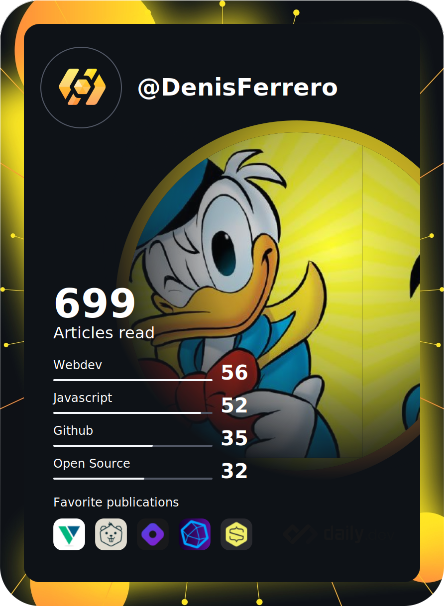

<h1 align="center">Hi 👋, I'm Denis Ferrero</h1>
<h3 align="center">a JS developer from Italy</h3>

<!-- Devcard https://daily.dev/blog/adding-the-daily-devcard-to-your-github-profile --> 
<a href="https://app.daily.dev/Denis_Ferrero"></a>

- 🔭 I’m currently working (when I got the time) on [Howard](https://github.com/DenisFerrero/Howard)

- 🌱 I’m currently learning **Cryptocurrency, Mobile development and new Web development solutions**

- 🏙 I work at **Tecnologic**

- 🏫 I study at [Politecnico of Turin](https://www.polito.it/)

- 🥳 Other hobbies? Build my own 3D printer


<!-- Wakatime https://github.com/athul/waka-readme --> 

<!--START_SECTION:waka-->
```text
Week: 14 December, 2021 - 20 December, 2021

Other        15 hrs 43 mins  ██████████████████▒░░░░░░   73.14 % 
Vue.js       2 hrs 23 mins   ██▓░░░░░░░░░░░░░░░░░░░░░░   11.15 % 
Markdown     2 hrs 14 mins   ██▓░░░░░░░░░░░░░░░░░░░░░░   10.41 % 
JavaScript   51 mins         █░░░░░░░░░░░░░░░░░░░░░░░░   04.00 % 
JSON         15 mins         ▒░░░░░░░░░░░░░░░░░░░░░░░░   01.22 % 
```
<!--END_SECTION:waka-->


<!-- ### Blogs posts -->
<!-- BLOG-POST-LIST:START -->
<!-- BLOG-POST-LIST:END -->

<h3 align="left">Connect with me:</h3>
<p align="left">
  <a href="https://dev.to/denisferrero" target="blank"></a>
  <a href="https://stackoverflow.com/users/15015607" target="blank"></a>
  <a href="https://instagram.com/ferrero.denis" target="blank"></a>
</p>

<h3 align="left">Languages and Tools:</h3>
<p align="left"> <a href="https://www.arduino.cc/" target="_blank">  </a> <a href="https://getbootstrap.com" target="_blank">  </a> <a href="https://www.w3schools.com/css/" target="_blank">  </a> <a href="https://www.docker.com/" target="_blank">  </a> <a href="https://expressjs.com" target="_blank">  </a> <a href="https://flutter.dev" target="_blank">  </a> <a href="https://git-scm.com/" target="_blank">  </a> <a href="https://www.w3.org/html/" target="_blank">  </a> <a href="https://developer.mozilla.org/en-US/docs/Web/JavaScript" target="_blank">  </a> <a href="https://www.linux.org/" target="_blank">  </a> <a href="https://nodejs.org" target="_blank">  </a> <a href="https://nuxtjs.org/" target="_blank">  </a> <a href="https://www.postgresql.org" target="_blank">  </a> <a href="https://postman.com" target="_blank">  </a> <a href="https://vuejs.org/" target="_blank">  </a> <a href="https://vuepress.vuejs.org/" target="_blank">  </a> </p>

<h3 align="left">Support:</h3>
<p><a href="https://www.buymeacoffee.com/DenisFerrero"> </a></p><br><br>

<p>
  
  
</p>
